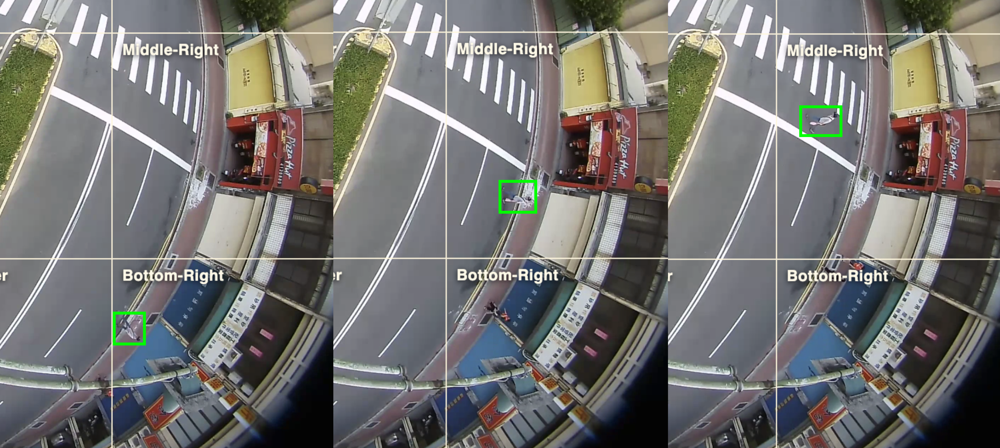

# FETV

FETV is a public clip-level dataset for traffic-event and traffic-violation analysis in fisheye surveillance video. The current public dataset contains 200 short MP4 clips and a flat JSON annotation file with one annotation row per clip.


## Authors

- Ahmed Abduljawad
- Nadeem Shahid Shaik
- Mohanrasu S S
- Ming-Ching Chang
- Jun-Wei Hsieh
- Munkhjargal Gochoo

## Dataset

[Link to download dataset](https://drive.google.com/drive/folders/1VMbtNo6zzWzjxVztzy842cn7xQ0rv25G?usp=drive_link)

## Dataset Size

- Public annotated clips: 200
- JSON rows: 200
- Distinct source videos represented: 9
- Annotation JSON size: 498 KiB
- Exported MP4 folder size: 563 MiB
- Clip archive size: 563 MiB

## Annotation Format

`FETV_export_public_230526_1738.json` is a flat JSON array. Each row describes one clip. The `clip_name` field is the clip identifier and each annotation is stored as a `question_*` / `answer_*` pair. Two examples are shown below.


```json
{
  "clip_name": "002_014.mp4",
    "question_date": "What is the date of the event? Return format: YYYY-MM-DD.",
    "answer_date": "2018-07-17",
    "question_time": "What is the time of the event? Return format: HH:MM:SS.",
    "answer_time": "17:06:47",
    "question_violation_type": "What is the violation type? Choose one: wrong_way, uturn, jaywalking, red_light, lane_use_control, lane_discipline, no_violation.",
    "answer_violation_type": "wrong_way",
    "question_violator_type": "What is the violator type? Choose one: car, motorcycle, pedestrian, bus, truck, na.",
    "answer_violator_type": "motorcycle",
    "question_color": "What is the violator color? Choose one: dark, light, red, green, yellow, blue, mixed, na.",
    "answer_color": "red",
    "question_initial_position": "What is the initial position of the violator? Choose one: Top-Left, Top-Center, Top-Right, Middle-Left, Middle-Center, Middle-Right, Bottom-Left, Bottom-Center, Bottom-Right, na.",
    "answer_initial_position": "Top-Right",
    "question_final_position": "What is the final position of the violator? Choose one: Top-Left, Top-Center, Top-Right, Middle-Left, Middle-Center, Middle-Right, Bottom-Left, Bottom-Center, Bottom-Right, na.",
    "answer_final_position": "Middle-Left",
    "question_initial_lane": "What is the initial lane? Choose one: 1, 2, 3, 4, na.",
    "answer_initial_lane": "1",
    "question_final_lane": "What is the final lane? Choose one: 1, 2, 3, 4, na.",
    "answer_final_lane": "2",
    "question_intersection_type": "What is the intersection type? Choose one: T-intersection, four-way intersection.",
    "answer_intersection_type": "T-intersection",
    "question_weather": "What is the weather condition? Choose one: clear, rainy, cloudy.",
    "answer_weather": "clear",
    "question_light": "What is the light condition? Choose one: daylight, night.",
    "answer_light": "daylight",
    "question_description": "Write a concise third-person description of the event. Use only visible evidence.",
    "answer_description": "On 2018-07-17 at 17:06:47, a traffic incident occurred at a T-intersection..."
}
```



```json
{
"clip_name": "001_001.mp4",
    "question_date": "What is the date of the event? Return format: YYYY-MM-DD.",
    "answer_date": "2018-07-17",
    "question_time": "What is the time of the event? Return format: HH:MM:SS.",
    "answer_time": "06:04:50",
    "question_violation_type": "What is the violation type? Choose one: wrong_way, uturn, jaywalking, red_light, lane_use_control, lane_discipline, no_violation.",
    "answer_violation_type": "jaywalking",
    "question_violator_type": "What is the violator type? Choose one: car, motorcycle, pedestrian, bus, truck, na.",
    "answer_violator_type": "pedestrian",
    "question_color": "What is the violator color? Choose one: dark, light, red, green, yellow, blue, mixed, na.",
    "answer_color": "mixed",
    "question_initial_position": "What is the initial position of the violator? Choose one: Top-Left, Top-Center, Top-Right, Middle-Left, Middle-Center, Middle-Right, Bottom-Left, Bottom-Center, Bottom-Right, na.",
    "answer_initial_position": "Bottom-Right",
    "question_final_position": "What is the final position of the violator? Choose one: Top-Left, Top-Center, Top-Right, Middle-Left, Middle-Center, Middle-Right, Bottom-Left, Bottom-Center, Bottom-Right, na.",
    "answer_final_position": "Middle-Right",
    "question_initial_lane": "What is the initial lane? Choose one: 1, 2, 3, 4, na.",
    "answer_initial_lane": "na",
    "question_final_lane": "What is the final lane? Choose one: 1, 2, 3, 4, na.",
    "answer_final_lane": "na",
    "question_intersection_type": "What is the intersection type? Choose one: T-intersection, four-way intersection.",
    "answer_intersection_type": "T-intersection",
    "question_weather": "What is the weather condition? Choose one: clear, rainy, cloudy.",
    "answer_weather": "clear",
    "question_light": "What is the light condition? Choose one: daylight, night.",
    "answer_light": "daylight",
    "question_description": "Write a concise third-person description of the event. Use only visible evidence.",
    "answer_description": "On 2018-07-17 at 06:04:50, a pedestrian wearing mixed-colored clothing..."
}
```

## Answer Fields

- `clip_name`: The exported MP4 filename, which links each JSON row to the corresponding clip file. Exported clip names use `XXX_XXX.mp4`, where the first segment is the source-video number and the second segment is the zero-based ordered clip number within that source video.
- `question_*`: The natural-language question for the corresponding answer field. Challenge submissions should include answer fields only, not question fields.
- `answer_date`: Date, expressed as `YYYY-MM-DD`.
- `answer_time`: Approximate time of the violation in `HH:MM:SS` format. This parameter is evaluated as correct or incorrect with a 7-second tolerance in each direction from the ground truth.
- `answer_violation_type`: Violation class. The supported exported labels are `wrong_way`, `jaywalking`, `red_light`, `uturn`, `lane_use_control`, `lane_discipline`, and `no_violation`.
- `answer_violator_type`: Bus, truck, car, motorcycle, pedestrian, or `na`. The `na` value is used for clips where no violator is present, such as No Violation clips.
- `answer_color`: The color of the violator, described approximately as `dark`, `light`, `red`, `green`, `yellow`, `blue`, `mixed`, or `na`. Use `mixed` if the violator has more than one color, and `na` when no violator is present.
- `answer_initial_position`: Approximate 3-by-3 grid position where the violator starts in the relevant square center crop of the fisheye frame. Expressed as `Top-Left`, `Top-Center`, `Top-Right`, `Middle-Left`, `Middle-Center`, `Middle-Right`, `Bottom-Left`, `Bottom-Center`, `Bottom-Right`, or `na`.
- `answer_final_position`: Approximate 3-by-3 grid position where the violator ends or exits the relevant square center crop of the fisheye frame. Expressed in the same way as the initial position.
- `answer_initial_lane`: The lane where the violator starts, where `1` describes the left-most lane from the driver perspective. Use `na` if this parameter is irrelevant.
- `answer_final_lane`: The lane where the violator ends or exits, expressed the same way as the initial lane.
- `answer_intersection_type`: T-intersection or four-way intersection.
- `answer_weather`: Weather condition, expressed as `clear`, `rainy`, or `cloudy`.
- `answer_light`: Lighting condition, expressed as `daylight` or `night`.
- `answer_description`: A natural-language description of the violation event.

## Violation Type Definitions

- **Wrong-Way Driving (`wrong_way`)**: A road user travels against the legal direction of traffic for the road segment or lane they occupy. This includes entering an opposing-direction lane, crossing a median into oncoming traffic, or continuing through the intersection in the opposite permitted direction. It does not include a brief lane adjustment, legal turning maneuver, or lane change where the vehicle remains aligned with the permitted traffic flow.
- **Jaywalking (`jaywalking`)**: A pedestrian crosses or enters the vehicle roadway outside the permitted pedestrian movement pattern, such as crossing away from a marked crosswalk, entering against pedestrian controls, or walking diagonally through active traffic space. It does not include pedestrians waiting on the sidewalk, standing on a refuge island, or crossing legally in a marked crosswalk with the permitted movement.
- **Running Red Light (`red_light`)**: A vehicle enters or proceeds through the intersection after the traffic signal for its movement is red. The violation includes crossing or running over the stop line during the red phase, even if the vehicle does not fully pass through the intersection. It also includes scenarios where a vehicle proceeds through the intersection while other vehicles are stopped at a red signal, even if the traffic light is not directly visible in the clip; in such cases, the red phase is inferred from the behavior of surrounding traffic. Free right turns are assumed to be permitted unless other vehicles are clearly stopped for a cross-traffic red that would conflict with the turning vehicle's path. The violation does not include vehicles already inside the intersection before the red phase, vehicles stopped at or before the stop line, or movements not governed by a visible red signal in the clip.
- **U-Turn (`uturn`)**: A road user performs a prohibited U-turn or near-180-degree reversal at or near the intersection where the movement conflicts with posted signs, lane markings, or normal intersection flow. It does not include legal left turns, normal curved turns into a permitted road segment, or continuous lane-following movement that does not reverse direction.
- **Lane-Use Control (`lane_use_control`)**: A vehicle uses a lane in a way that conflicts with its designated permitted movement, such as proceeding straight from a turn-only lane, turning from a through-only lane, or using an incorrect lane for the intended maneuver. It does not include minor within-lane positioning, lane discipline issues that do not violate the lane's assigned movement, or cases where lane markings are not visible enough to infer lane-use restrictions.
- **Lane Discipline (`lane_discipline`)**: A vehicle fails to maintain proper lane discipline, such as drifting across lane markings, straddling lanes, or changing lanes in an unsafe or prohibited manner within the observed scene. It does not include a correctly executed turn, a normal lane change where allowed, or lane-use violations better described by `lane_use_control`. If the lane change causes the vehicle to enter an opposite-direction lane, the event should be described as Wrong-Way Driving (`wrong_way`) rather than Lane Discipline.
- **No Violation (`no_violation`)**: The clip contains traffic activity but no target violation from the defined taxonomy. This class is used for normal traffic behavior, legal pedestrian movement, or scenes where road users remain compliant with visible rules. It should not be used when a clear violation from any of the above categories is present.

## Intended Use

This dataset is intended for research and development in:

- Traffic-event classification from video clips.
- Traffic-violation attribute prediction.
- Fisheye traffic-scene understanding.
- Captioning or report generation for traffic events.

## Evaluation

The evaluator aligns prediction rows to ground truth by `clip_name` when both files contain unique clip names. Identifier fields such as `clip_name`, `video_id`, `clip_export_name`, `start_time`, and `end_time` are used for matching or provenance only and are not scored.

### Installation

Use Python 3.9 or newer, then install the evaluator dependencies:

```bash
python -m venv venv
source venv/bin/activate
pip install -r requirements.txt
```

The first evaluation run may download the BERTScore model, which can be about 1 GB.

### Running Evaluation

Evaluate a submission JSON file against a ground-truth JSON file:

```bash
python evaluate.py submission.json --gt groundtruth.json
```

Detailed scores are written next to the submission as `submission.results.json`.

### Submission Format

Submissions should be a flat JSON array where each object describes one exported clip. Submit `clip_name` and answer fields only. Do not include the `question_*` fields in challenge submissions.

```json
[
  {
  "clip_name": "001_000.mp4",
  "answer_date": "2026-01-01",
  "answer_time": "12:34:56",
  "answer_violation_type": "wrong_way",
  "answer_violator_type": "car",
  "answer_color": "light",
  "answer_initial_position": "Top-Left",
  "answer_initial_lane": "1",
  "answer_final_position": "Middle-Right",
  "answer_final_lane": "2",
  "answer_intersection_type": "T-intersection",
  "answer_weather": "clear",
  "answer_light": "daylight",
  "answer_description": "Dummy event."
  }
]
```

### Ground Truth Format

Ground truth may use the same answer-only structure as submissions. If a full annotation export is used as ground truth, the evaluator ignores `question_*` fields and scores the matching `answer_*` fields.

### Metrics

Categorical answer fields are evaluated with macro-averaged F1. The time field is evaluated as a binary match per row with a 7-second tolerance, then averaged. The description field is evaluated with the average of normalized CIDEr and BERTScore.

```text
MacroF1 = mean(per-field F1 scores and the time-tolerance score)
DescriptionScore = (CIDEr_norm + BERTScore) / 2
FinalScore = (MacroF1 + DescriptionScore) / 2
```

Equivalently:

```text
FinalScore = 0.25 * CIDEr_norm + 0.25 * BERTScore + 0.5 * MacroF1
```

### Output

The result JSON contains one score per evaluated answer field, the `categorical_mean`, and the `final_score`. The `categorical_mean` key averages all categorical macro-F1 scores plus the `answer_time` tolerance score. The `answer_description` field stores the combined description score; CIDEr and BERTScore sub-scores are printed in the terminal during evaluation but are not written as separate JSON keys.

If an invalid `answer_time` value is found, that row is scored as incorrect for time, an `errors` array is added to the result JSON, and the evaluator exits with a nonzero status after writing the result file.

```json
{
  "field_scores": {
    "answer_date": 1.0,
    "answer_violation_type": 1.0,
    "answer_violator_type": 1.0,
    "answer_color": 1.0,
    "answer_initial_position": 1.0,
    "answer_initial_lane": 1.0,
    "answer_final_position": 1.0,
    "answer_final_lane": 1.0,
    "answer_intersection_type": 1.0,
    "answer_weather": 0.3333333333333333,
    "answer_light": 1.0,
    "answer_time": 1.0,
    "answer_description": 1.0
  },
  "categorical_mean": 0.9444444444444445,
  "final_score": 0.9722222222222223
}
```

### Troubleshooting

- Ensure submission files are valid JSON: `python -m json.tool submission.json > /dev/null`.
- Keep `clip_name` values unchanged from the exported MP4 files.
- If BERTScore fails on the first run, check network access and available disk space for the model download.
